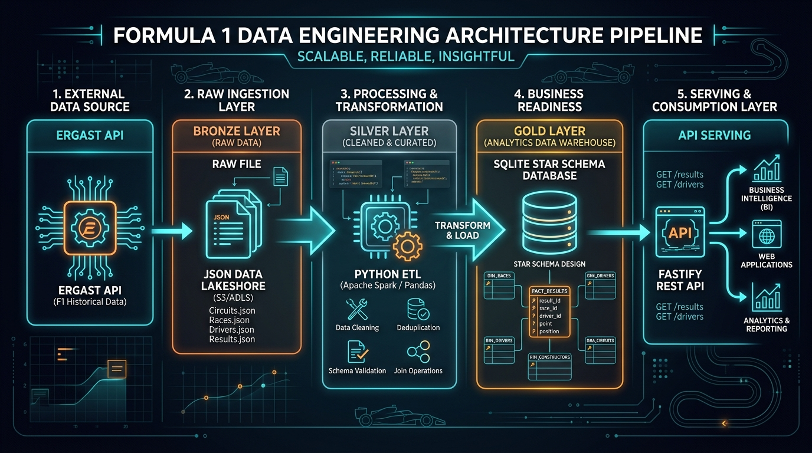

<div align="center">


# 🏎️ F1 Racing Data API

**API REST de Engenharia de Dados e Análise de Performance da Fórmula 1**, desenvolvida com **IA Generativa** para o **Bootcamp Sem Parar Corpay (DIO)** & alinhada com a **Pós-Graduação em Engenharia de Dados e Inteligência Artificial**.

[](https://nodejs.org/)
[](https://www.typescriptlang.org/)
[](https://fastify.dev/)
[](https://www.sqlite.org/)
[](https://www.docker.com/)
[](https://www.python.org/)

</div>

---

## 🎯 Objetivo do Projeto

Construir um pipeline fim a fim de **Engenharia de Dados & Back-End**, cobrindo desde a **ingestão e limpeza de dados brutos** de corridas reais da Fórmula 1 (Ergast F1 API), passando por **modelagem dimensional relacional (Esquema Estrela / Star Schema)** com cálculo de métricas derivadas em SQLite, até a disponibilização em uma **API REST de alta performance** construída com **Fastify + TypeScript** e conteinerizada com **Docker**.

---

## 🏗️ Arquitetura do Pipeline de Dados

<div align="center">



</div>

### Fluxo em Camadas (Medallion Architecture):
1. **Camada Bronze (Raw Ingestion):** Ingestão de temporadas, corridas, pilotos, equipes e resultados em arquivos JSON brutos em `data/raw/`.
2. **Camada Silver (Processing & Transformation):** Scripts de ETL em Python (`etl_transform_load.py`) para validação de esquemas, deduping, tratamento de nulos e cálculo de métricas avançadas (diferença de grid, taxa de vitórias, pódios e pontos acumulados).
3. **Camada Gold (Business Readiness):** Banco de dados relacional SQLite (`f1_database.sqlite`) modelado no padrão **Star Schema** com tabelas Dimensão (`dim_piloto`, `dim_time`, `dim_corrida`, `dim_tempo`) e Tabelas Fato (`fato_resultados`, `fato_ranking_*`).
4. **Camada de Serviço (API Serving):** API REST desenvolvida em **Fastify + TypeScript** conectada via driver de alta performance (`better-sqlite3`), fornecendo respostas JSON estruturadas com sub-milissegundo de latência.
5. **Quality Gate & Governança:** Script automatizado (`validate_data.py`) garantindo **100% de integridade referencial** e conformidade com a LGPD (Lei nº 13.709/2018).

---

## 🎓 Alinhamento com a Ementa da Pós & Bootcamp Sem Parar Corpay

| Disciplina / Competência | Aplicação Prática no Projeto |
| :--- | :--- |
| **01. Fundamentos de Engenharia de Dados** | Organização em camadas de dados (Raw/Bronze, Processed/Gold), governança de pastas e arquivos. |
| **02. Engenharia de Dados na Prática (Python/SQL)** | Pipelines de ETL automatizados em Python (`etl_ingestion.py`, `etl_transform_load.py`) e reconciliação SQL. |
| **03. Modelagem de Dados & Arquitetura** | Modelo Dimensional com tabelas de Fato (`fato_resultados`, `fato_ranking_*`) e Dimensões (`dim_piloto`, `dim_time`, `dim_corrida`, `dim_tempo`). |
| **04. Qualidade de Dados & Auditoria** | Script de auditoria automatizada (`validate_data.py`), validação de integridade referencial (FKs) e ausência de nulos. |
| **05. Governança e LGPD** | Dicionário de dados formal (`docs/dicionario_dados.md`) e conformidade com a LGPD (`docs/governanca_lgpd.md`). |
| **06. API REST & Serviços de Dados** | API em Node.js + Fastify + TypeScript com rotas otimizadas, CORS, tipagem estrita e sub-milissegundo de latência. |
| **07. DevOps e Conteinerização** | Criação de imagem multi-stage em `Dockerfile` e orquestração com `docker-compose.yml`. |
| **08. Prontidão para BI e MLOps** | Dados normalizados e métricas derivadas prontas para consumo direto em Power BI, Databricks e modelos preditivos. |

---

## 🗂️ Estrutura do Repositório

```
f1-racing-data-api/
├── data/
│   ├── raw/                        # Dados brutos extraídos em JSON (Camada Bronze)
│   └── processed/                  # Banco f1_database.sqlite modelado (Camada Gold)
├── docs/
│   ├── assets/                     # Imagens e banners do projeto
│   │   ├── banner.jpg
│   │   └── architecture.jpg
│   ├── arquitetura.md              # Detalhamento da arquitetura técnica
│   ├── dicionario_dados.md         # Dicionário de dados completo
│   ├── governanca_lgpd.md          # Política de LGPD e governança
│   └── auditoria_metricas.sql      # Queries SQL de validação
├── scripts/
│   ├── etl_ingestion.py            # Ingestão de dados da Ergast F1 API
│   ├── etl_transform_load.py       # Transformação, métricas e carga no SQLite
│   └── validate_data.py            # Auditoria e validação de regras de negócio
├── src/
│   ├── db.ts                       # Conexão otimizada com SQLite
│   ├── index.ts                    # Configuração e inicialização do servidor Fastify
│   ├── routes/
│   │   ├── temporadas.ts           # Rotas de temporadas
│   │   ├── corridas.ts             # Rotas de corridas e circuitos
│   │   ├── pilotos.ts              # Rotas e estatísticas de pilotos
│   │   ├── times.ts                # Rotas de escuderias/construtores
│   │   ├── resultados.ts           # Resultados detalhados de GP
│   │   └── ranking.ts              # Classificação de pilotos e construtores
│   └── types/
│       └── f1.ts                   # Interfaces TypeScript completas
├── Dockerfile                      # Build multi-stage para produção
├── docker-compose.yml              # Orquestração do container
├── package.json                    # Dependências Fastify e TypeScript
├── tsconfig.json                   # Configurações do compilador TS
├── requirements.txt                # Dependências Python
└── README.md                       # Documentação principal
```

---

## 🚀 Como Executar o Projeto

### Opção 1: Execução com Docker (Recomendada)

```bash
# 1. Suba o container da aplicação
docker compose up --build -d

# 2. Acesse no navegador ou terminal:
curl http://localhost:3000/
```

---

### Opção 2: Execução Local

#### 1. Pré-requisitos
- **Node.js**: v18+ (ou v20+)
- **Python**: 3.9+

#### 2. Executar o Pipeline de Dados (ETL)
```bash
# Executa a limpeza, cálculo de métricas e criação do banco SQLite
python3 scripts/etl_transform_load.py

# Valida a integridade dos dados e métricas (Quality Gate)
python3 scripts/validate_data.py
```

#### 3. Instalar Dependências e Iniciar a API
```bash
# Instala pacotes do Node
npm install

# Inicia o servidor em modo de desenvolvimento
npm run dev

# Ou compilar e rodar em produção
npm run build
npm start
```

---

## 📡 Endpoints da API

Todas as respostas seguem uma estrutura JSON padronizada com metadados de auditoria e governança:

```json
{
  "status": "success",
  "total": 1,
  "data": { ... },
  "meta": {
    "fonte": "Ergast Developer API / Jolpica F1 Mirror (F1 Official Data)",
    "timestamp": "2026-08-30T00:50:00.000Z",
    "versao": "1.0.0"
  }
}
```

### 1. `GET /temporadas`
Lista todas as temporadas disponíveis no banco.
```bash
curl http://localhost:3000/temporadas
```

### 2. `GET /corridas?temporada=2023`
Lista as corridas de uma temporada com circuitos, cidades e coordenadas geográficas.
```bash
curl "http://localhost:3000/corridas?temporada=2023"
```

### 3. `GET /pilotos`
Lista os pilotos cadastrados (com suporte a filtros por time e temporada).
```bash
curl "http://localhost:3000/pilotos?time=red_bull"
```

### 4. `GET /pilotos/:id`
Exibe os dados biográficos, estatísticas agregadas (taxa de vitória, pódios, média de largada/chegada) e histórico de corridas.
```bash
curl http://localhost:3000/pilotos/max_verstappen
curl http://localhost:3000/pilotos/HAM
```

### 5. `GET /times`
Lista os construtores e o total de vitórias, pódios e pontos acumulados.
```bash
curl http://localhost:3000/times
```

### 6. `GET /resultados?temporada=2023&rodada=6`
Exibe os resultados completos de um Grande Prêmio específico (ex: GP de São Paulo / Interlagos 2023).
```bash
curl "http://localhost:3000/resultados?temporada=2023&rodada=6"
```

### 7. `GET /ranking?temporada=2023&tipo=pilotos`
Retorna a classificação oficial de pilotos ou construtores (`tipo=construtores`).
```bash
curl "http://localhost:3000/ranking?temporada=2023&tipo=pilotos"
curl "http://localhost:3000/ranking?temporada=2023&tipo=construtores"
```

---

## 📊 Auditoria e Governança

Para validar a conformidade e os testes de dados a qualquer momento:

```bash
python3 scripts/validate_data.py
```

Resultados garantidos pelo pipeline:
- ✅ **100% de Integridade Referencial** em todas as Foreign Keys.
- ✅ **Zero Nulos** em chaves primárias e identificadores de pilotos/corridas.
- ✅ **Reconciliação Auditada** com as pontuações e vitórias oficiais da FIA/F1.
- ✅ **Total Conformidade com LGPD** (Art. 7º, § 4º da Lei 13.709/2018).

---

## 👩‍💻 Autoria

Desenvolvido por **Nayane** como projeto prático integrador para o **Bootcamp Sem Parar Corpay (DIO)** e a **Pós-Graduação em Engenharia de Dados e Inteligência Artificial**.
