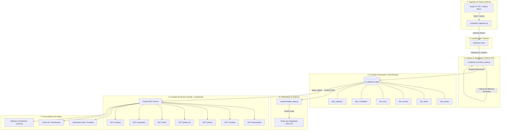

# 🏗️ Arquitetura de Dados — F1 Racing Data API

A arquitetura do projeto adota o padrão moderno de Engenharia de Dados baseado em camadas (Medallion Architecture adaptada):

```mermaid
flowchart TD
    subgraph INGESTION["1. Ingestão de Dados (Python)"]
        API["Ergast F1 API / Jolpica Mirror"] -->|REST / JSON| INGEST["scripts/etl_ingestion.py"]
    end

    subgraph STORAGE_RAW["2. Camada Raw / Bronze"]
        INGEST -->|Arquivos Brutos| RAW["data/raw/*.json"]
    end

    subgraph ETL_PIPELINE["3. Limpeza & Modelagem (Python ETL)"]
        RAW -->|Validação & Limpeza| ETL["scripts/etl_transform_load.py"]
        ETL -->|Cálculo de Métricas Derivadas| ETL
    end

    subgraph STORAGE_PROCESSED["4. Camada Processada / Gold (SQLite)"]
        ETL -->|Modelo Dimensional| DB[(f1_database.sqlite)]
        DB --- DIM_T["dim_tempo"]
        DB --- DIM_P["dim_piloto"]
        DB --- DIM_C["dim_corrida"]
        DB --- DIM_E["dim_time"]
        DB --- FATO_R["fato_resultados"]
        DB --- FATO_RK["fato_ranking_*"]
    end

    subgraph QUALITY["5. Governança & Auditoria"]
        DB -->|Auditoria SQL| VAL["scripts/validate_data.py"]
        VAL -->|Quality Gate| PASS["Testes de Integridade 100% OK"]
    end

    subgraph SERVING_LAYER["6. Camada de Serviço (Fastify + TypeScript)"]
        DB -->|better-sqlite3| FASTIFY["Fastify REST Server"]
        FASTIFY --> R1["GET /temporadas"]
        FASTIFY --> R2["GET /corridas"]
        FASTIFY --> R3["GET /pilotos"]
        FASTIFY --> R4["GET /pilotos/:id"]
        FASTIFY --> R5["GET /times"]
        FASTIFY --> R6["GET /resultados"]
        FASTIFY --> R7["GET /ranking"]
    end

    subgraph CONSUMERS["7. Consumidores de Dados"]
        FASTIFY --> WEB["Aplicações Web / Frontend"]
        FASTIFY --> PBI["Power BI / Dashboards"]
        FASTIFY --> ML["Pipelines de Machine Learning"]
    end
```
